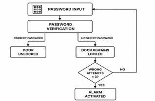
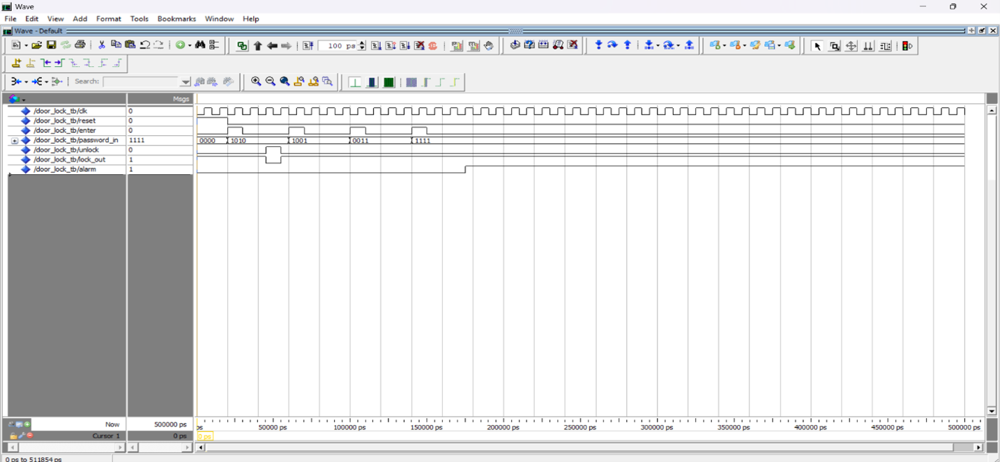

# Password-Based Digital Door Lock using VHDL

## Overview

This project presents the design and simulation of a password-based digital door lock system using VHDL.

The system uses a Finite State Machine (FSM) to control password verification, door access, incorrect-attempt handling, and alarm activation. The design was verified using ModelSim simulation.

A predefined 4-bit password of `1010` is used for authentication. A correct password unlocks the door, while an incorrect password keeps the door locked. After three consecutive incorrect attempts, the system activates the alarm.

## System Features

- 4-bit password authentication
- FSM-based control logic
- Correct password detection
- Incorrect password rejection
- Three-attempt security mechanism
- Alarm activation after three consecutive incorrect attempts
- Reset functionality
- VHDL implementation
- ModelSim-based simulation and verification

## System Architecture

The system consists of:

- Password Input
- Password Verification
- Finite State Machine Controller
- Door Lock/Unlock Control
- Incorrect Attempt Counter
- Alarm Control
- Reset

### Block Diagram

## FSM Design

The Digital Door Lock System uses five states:

| State | Function |
|---|---|
| IDLE | Initial state; door remains locked |
| CHECK_PASSWORD | Compares entered password with stored password |
| UNLOCK_STATE | Correct password; door is unlocked |
| WRONG_STATE | Incorrect password; access is denied |
| ALARM_STATE | Activated after three consecutive incorrect attempts |

### State Transitions

- `IDLE → CHECK_PASSWORD` when password entry is initiated
- `CHECK_PASSWORD → UNLOCK_STATE` when password = `1010`
- `CHECK_PASSWORD → WRONG_STATE` when password ≠ `1010`
- `WRONG_STATE → IDLE` when incorrect attempts are fewer than three
- `WRONG_STATE → ALARM_STATE` after three incorrect attempts
- `UNLOCK_STATE → IDLE` after the unlock operation
- `ALARM_STATE → IDLE` after reset

## Working Principle

1. The system starts in the IDLE state.
2. The user enters a 4-bit password.
3. The entered password is compared with the predefined password `1010`.
4. If the password is correct, the door is unlocked.
5. If the password is incorrect, access is denied.
6. The system counts consecutive incorrect attempts.
7. After three consecutive incorrect attempts, the alarm is activated.
8. The reset input returns the system to its initial state.

## VHDL Implementation

The digital door lock was implemented using VHDL. The design includes password comparison logic, FSM-based state control, door lock/unlock control, and an alarm mechanism.

The main VHDL design file is:

`door_lock.vhd`

## Testbench

A VHDL testbench was developed to verify the behaviour of the digital door lock under different password conditions.

The testbench applies different input combinations and observes the corresponding system outputs.

The testbench file is:

`door_lock_tb.vhd`

## Simulation and Verification

The design and testbench were compiled and simulated using ModelSim.

The following conditions were verified:

| Input Condition | Door Status | Alarm |
|---|---|---|
| Correct password `1010` | Unlocked | OFF |
| Incorrect password | Locked | OFF |
| Three consecutive incorrect attempts | Locked | ON |

### ModelSim Waveform

The simulation verifies the intended behaviour of password authentication, door access control, incorrect-password handling, and alarm activation.

## Simulation Results

The ModelSim simulation demonstrated:

- Successful authentication using the correct password
- Door unlocking for the valid password
- Access denial for incorrect passwords
- Alarm activation after repeated incorrect attempts
- Reset-based return to the initial state

## Applications

The design can be used as a basic digital access-control system for:

- Residential buildings
- Offices
- Laboratories
- Educational institutions
- Industrial facilities
- Storage areas
- Smart-home security systems

## Tools and Technologies

- VHDL
- ModelSim
- Finite State Machines (FSM)
- Digital Logic Design
- Sequential Logic
- Testbench Development
- Digital System Verification

## Standard

The VHDL design follows the IEEE 1076 VHDL standard.

## Future Scope

The project can be extended by integrating:

- Keypad-based password entry
- Programmable password storage
- FPGA implementation
- LCD/OLED user interface
- User authentication logging
- Configurable attempt limits
- Additional security mechanisms

## Author

**Priya Vaid**

Electrical and Electronics Engineering  
Manipal Institute of Technology
